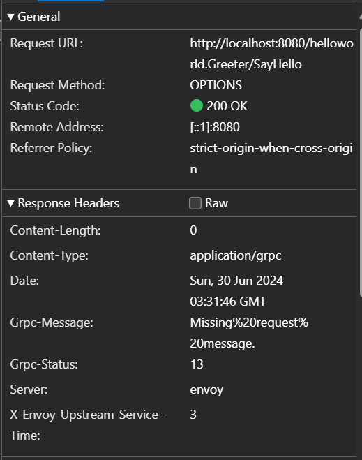
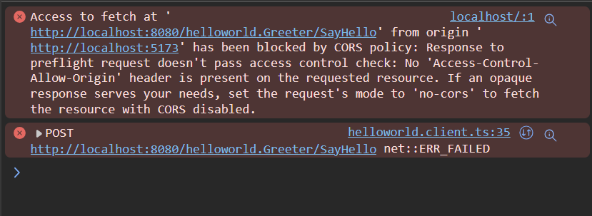
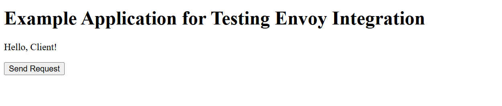

# gRPC Web with Rust

This repository covers an example application for setting up a basic Svelte app to communicate with a Tonic backend through gRPC using `protobuf-ts/grpcweb-transport`, using Envoy to proxy the request. This is to showcase an issue in configuring CORS for gRPC services in Envoy.

## Reproducing CORS Issue

Reproducing the issue requires Docker, Docker Compose, and NPM.

1. Build Tonic docker container with `docker compose build`
1. Spin up the docker containers in the background with `docker compose up -d`
1. Confirm that the `tonic` server is reachable by a gRPC client by running the client container with `docker compose run client`. You should see a success response.
1. Install the npm dependencies with `npm install`
1. Start the frontend app with `npm run dev`
1. Navigate to the app page
1. Open the Network tab and the Console on the page
1. Press the button to make the request
   - Expected message: "Hello, Client!"
   - Actual message displayed: "Error: RpcError: Failed to fetch Code: INTERNAL Method: helloworld.Greeter/SayHello"

## Investigation

From taking a look at the response body payload, it seems that the first OPTIONS request gets forwarded to the Tonic server despite the CORS filter that should be preventing this. This is supported by inspecting the stats: both `http.ingress_http.cors.origin_invalid` and `http.ingress_http.cors.origin_valid` never increment.



In addition, it doesn't seem like the appropriate CORS headers are being set, as shown in the console logs.



Finally, by adding the following to the `route_config`, we can see that the client is able to interact with the gRPC server as expected

```yaml
response_headers_to_add:
  - header:
      key: 'Access-Control-Allow-Origin'
      value: '*'
  - header:
      key: 'Access-Control-Allow-Headers'
      value: '*'
```



However, inspecting the OPTIONS payload still shows that a `Grpc-Message` header gets set with value `Missing%20request%20message.`.

## Notes & References

The [Envoy configs](./envoy.yaml) were created using Envoy's [documentation](https://www.envoyproxy.io/docs/envoy/latest/configuration/http/http_filters/cors_filter), and borrowing in part from the [CORS example](https://github.com/envoyproxy/envoy/tree/main/examples/cors).

The Tonic app uses the [helloworld](https://github.com/hyperium/tonic/tree/master/examples/src/helloworld) Tonic example, and has been modified so that client and server are compiled as separate crates.

The Dockerfile has been written to ensure that the gRPC client and server both benefit from docker layer caching, so the dependency recompilation will only be triggered if either of the Cargo.toml/Cargo.lock files change.
